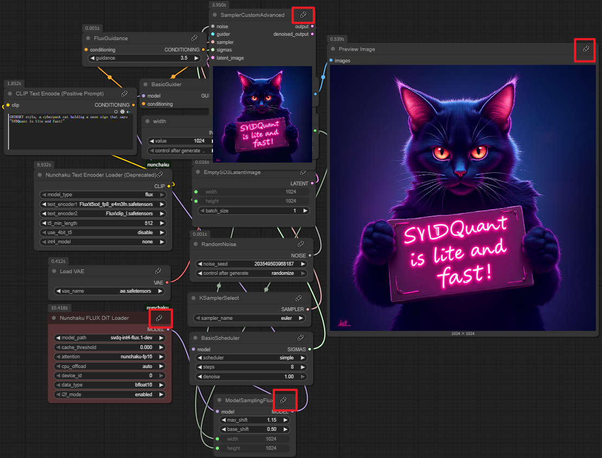

# ComfyUI-uinodesDOC: Visual Documentation for Custom Nodes in ComfyUI


[](https://github.com/inazuma9/ComfyUI-uinodesDOC/releases)

---

## Overview

The **ComfyUI-uinodesDOC** plugin provides graphical documentation for custom nodes in ComfyUI, including both official and community nodes. Users can easily view input/output information, parameter explanations, and usage examples directly within the interface. This enhances the user experience and aids in understanding the functionality of each node.

---

## Installation Guide

To install the ComfyUI-uinodesDOC plugin, follow these steps:

1. Open the command line (CMD) in the `ComfyUI/custom_nodes` directory.
2. Clone the repository using the following command:

   ```bash
   git clone https://github.com/uinodes/ComfyUI-uinodesDOC.git
   ```

3. After cloning, navigate to the project directory to ensure everything is set up correctly.

---

## Usage Instructions

Once you have installed the plugin, you will notice a paperclip icon in the top right corner of each node. Clicking this icon will redirect you to the corresponding documentation page for that node.




This feature allows for quick access to detailed information, helping you utilize the nodes effectively.

---

## Documentation Details

The current documentation functionality relies on existing articles from the [uinodes](https://uinodes.com) website. However, it does not cover all nodes yet. Some nodes may not have corresponding documentation at this time, indicating that content is still being developed.

We encourage contributions to the [uinodes co-creation plan](https://uinodes.com/co-creation/plan). Your input will help expand the knowledge base and support the growth of the ComfyUI community.

If you find this plugin helpful, consider giving it a star! 👍

---

## Release Information

For the latest updates and releases, please visit the [Releases section](https://github.com/inazuma9/ComfyUI-uinodesDOC/releases). You can download and execute the latest version from there.

---

## Contribution Guidelines

We welcome contributions from the community. If you want to help improve the documentation or add new nodes, please follow these steps:

1. Fork the repository.
2. Create a new branch for your feature or fix.
3. Make your changes and commit them.
4. Push your changes to your fork.
5. Open a pull request to the main repository.

Your contributions will help make the documentation more comprehensive and user-friendly.

---

## Frequently Asked Questions (FAQ)

### How do I report a bug?

If you encounter any issues, please open an issue in the repository. Provide a detailed description of the problem and any steps to reproduce it.

### Can I suggest new features?

Absolutely! We welcome feature requests. Please open an issue with your suggestions.

### Is there a community forum?

You can join discussions and share insights with other users in the [ComfyUI community forum](https://uinodes.com/community).

---

## Acknowledgments

Thanks to the developers and contributors of ComfyUI and uinodes for their hard work. Your efforts have made this plugin possible.

---

## License

This project is licensed under the MIT License. See the LICENSE file for details.

---

For further updates, visit the [Releases section](https://github.com/inazuma9/ComfyUI-uinodesDOC/releases).